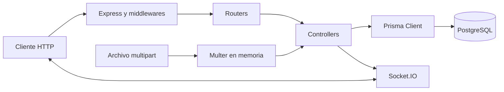

# Backend Prográficos

API para administrar la operación de producción gráfica: usuarios, terceros, proveedores, formatos, medidas, papeles, maquinaria, troqueles, productos, órdenes de producción, ejecución secuencial de procesos y auditoría de órdenes cerradas.

> Estado de este análisis: 15 de julio de 2026. Este repositorio contiene únicamente el backend; no hay vistas, componentes de interfaz ni rutas de navegación de frontend. En este documento, “rutas” se refiere a endpoints HTTP y al canal Socket.IO.

## Documentación

- [Guía de desarrollo y buenas prácticas](./GUIA_DESARROLLO.md): reglas obligatorias, nomenclatura, arquitectura objetivo, seguridad, pruebas y definición de terminado.
- [Referencia histórica de endpoints](./API_ENDPOINTS.md): útil como apoyo, pero parcialmente desactualizada. Las rutas montadas en `src/server.js` y los archivos de `src/routes/` son la fuente de verdad actual.

## Qué resuelve

El dominio se organiza alrededor de este flujo:

1. Se configuran catálogos operativos: formatos, medidas, papeles y proveedores, maquinaria, procesos y troqueles.
2. Un producto relaciona un tercero/cliente con un troquel.
3. Una orden selecciona producto, papel, medida, cavidades y procesos.
4. Los procesos de la orden se ejecutan en el orden configurado.
5. Al iniciar y terminar procesos se actualiza automáticamente el estado de la orden.
6. Los cambios de producción se notifican por Socket.IO y las órdenes terminadas quedan disponibles para auditoría.

## Tecnologías actuales

| Área | Tecnología | Versión declarada o resuelta |
| --- | --- | --- |
| Runtime | Node.js con ES Modules | Node 20 en Docker |
| API HTTP | Express | 4.22.1 |
| ORM | Prisma Client / Prisma CLI | 5.22.0 |
| Base de datos | PostgreSQL | Configurada mediante `DATABASE_URL` |
| Autenticación | JSON Web Token + bcryptjs | jsonwebtoken 9.0.3 / bcryptjs 3.0.3 |
| Sesión web | Cookie HTTP-only o Bearer token | cookie-parser 1.4.7 |
| Tiempo real | Socket.IO | 4.8.3 |
| Carga de archivos | Multer en memoria | 2.1.1, máximo 20 MB por troquel |
| Observabilidad básica | Morgan + consola | morgan 1.10.1 |
| Despliegue | Docker | Imagen `node:20-bullseye-slim` |

El proyecto no tiene actualmente suite de pruebas, linter, formatter, documentación OpenAPI ni pipeline de integración continua.

## Arquitectura actual



Es una arquitectura por capas sencilla. Los routers declaran transporte y permisos; los controladores concentran hoy validación, reglas de negocio y acceso a datos; Prisma define el modelo y las migraciones. La separación futura esperada para lógica compleja está detallada en `GUIA_DESARROLLO.md`.

## Estructura de carpetas

```text
backend-prograficos/
├── prisma/
│   ├── migrations/              # Historial incremental de PostgreSQL
│   ├── schema.prisma            # Esquema actual: 14 modelos y 10 enums
│   └── seed.js                  # Catálogos, usuarios y datos de demostración
├── src/
│   ├── config/db.js             # Prisma Client y ciclo de conexión
│   ├── constants/               # Valores de dominio compartidos
│   ├── controllers/             # HTTP + reglas de negocio + consultas actuales
│   ├── middlewares/             # JWT y autorización por roles
│   ├── routes/                  # Endpoints Express por recurso
│   ├── utils/                   # Activos, paginación, strings, JWT y tiempo real
│   └── server.js                # Composición de la app, CORS, Socket.IO y arranque
├── API_ENDPOINTS.md             # Referencia histórica; requiere sincronización
├── GUIA_DESARROLLO.md           # Estándar de desarrollo del equipo
├── Dockerfile
├── package.json
└── prisma.config.ts
```

`src/controllers/product_customer.controller.js` y `src/routes/product_customer.routes.js` son código heredado no montado. El modelo `Product_Customer` fue eliminado por la migración de abril de 2026; no deben importarse ni exponerse nuevamente.

## Modelo de dominio resumido

| Agregado o catálogo | Responsabilidad y relaciones principales |
| --- | --- |
| `User` | Identidad, rol y autoría de órdenes/procesos. |
| `Thirds` | Cliente, proveedor u otro tercero; posee productos y puede suministrar papeles. |
| `Troqueles` | Troquel por tamaño y código; puede almacenar archivo base64. |
| `Product` | Puente actual entre tercero y troquel, con nombre opcional. |
| `Format` / `Measure` | Formato, divisiones por pliego y dimensiones físicas. |
| `Paper_Type` / `PaperTypeSupplier` | Tipo de papel y precio por proveedor. |
| `Machinery` | Equipo operativo clasificado por tipo. |
| `Process` / `Process_Field_Definition` | Secuencia productiva y campos configurables del proceso. |
| `Header_Production_Order` | Cabecera, cantidades, estado, producto y catálogos seleccionados. |
| `Detail_Production_Order` | Ejecución de cada proceso de la orden. |
| `Detail_Process_Field_Value` | Valores capturados para los campos configurables. |

Las eliminaciones funcionales se implementan mayoritariamente como borrado lógico mediante `is_active = false`.

## Requisitos para desarrollo local

- Node.js 20 o superior. Para reproducibilidad, se recomienda Node 20, igual que la imagen Docker.
- npm compatible con `package-lock.json` versión 3.
- Una instancia accesible de PostgreSQL.
- Variables de entorno válidas.

## Configuración local

Ejecutar desde PowerShell en la raíz del repositorio:

```powershell
Set-Location -LiteralPath 'C:\Users\juanp\Desktop\PROGRAFICOS\backend-prograficos'
Copy-Item -LiteralPath '.env.example' -Destination '.env'
npm ci
npx prisma generate
npx prisma migrate dev
npx prisma db seed
npm run dev
```

La API quedará disponible, por defecto, en `http://localhost:5001`.

El seed crea catálogos, usuarios y órdenes de demostración. Contiene credenciales conocidas y reactiva determinados registros de catálogo; debe tratarse como una herramienta de desarrollo, no como parte automática de un arranque productivo sin revisión.

### Variables de entorno

| Variable | Requerida | Valor por defecto | Uso |
| --- | --- | --- | --- |
| `DATABASE_URL` | Sí | Ninguno | Cadena de conexión PostgreSQL de Prisma. |
| `JWT_SECRET` | Sí | Ninguno | Firma y validación de tokens. Usar un secreto largo y aleatorio. |
| `PORT` | No | `5001` | Puerto HTTP interno. |
| `CORS_ALLOWED_ORIGINS` | No | Lista definida en `server.js` | Orígenes exactos separados por coma, sin rutas. |
| `SOCKET_IO_PATH` | No | `/socket.io` | Path del handshake de Socket.IO. |
| `JWT_EXPIRES_IN` | No | `1d` | Vigencia del JWT. |
| `COOKIE_SECURE` | No | Activa en producción | Fuerza cookie segura cuando vale `true`. |
| `COOKIE_CROSS_SITE` | No | Habilitada | Usa `SameSite=None` y cookie particionada si también es segura. |
| `NODE_ENV` | No | Entorno del proceso | Controla logs de Prisma y seguridad de cookie. |
| `SEED_BULK_ORDERS` | No | `0` | Cantidad de órdenes de carga generadas por el seed. Solo desarrollo. |

`CORS_ALLOWED_ORIGINS` debe contener orígenes como `https://app.example.com`, nunca `https://app.example.com/login` ni rutas del proxy.

> Observación del repositorio actual: `.gitignore` también ignora `.env.example`, por lo que el archivo puede no llegar a clones nuevos. Debe corregirse y versionarse una plantilla sin secretos antes de depender de ella en el onboarding.

## Scripts disponibles

| Comando | Descripción |
| --- | --- |
| `npm run dev` | Ejecuta `node --watch src/server.js`. |
| `npm start` | Inicia el servidor sin migrar ni sembrar datos. |
| `npm run start:prod` | Ejecuta `prisma migrate deploy`, luego el seed y finalmente el servidor. |
| `npm run seed:orders:500` | Agrega 500 órdenes de prueba. No es idempotente. |

El script `start:prod` actual ejecuta el seed en cada arranque. Antes de usarlo en un entorno real debe separarse el bootstrap productivo de la carga de datos demo.

## Autenticación y roles

Los endpoints protegidos aceptan el token mediante:

```http
Authorization: Bearer <token>
```

o mediante la cookie HTTP-only `token`. El middleware consulta el usuario en cada petición y rechaza usuarios inexistentes o inactivos.

Roles disponibles:

- `ADMIN`: administración total de catálogos y usuarios.
- `SUPERVISOR`: administración operativa, con restricciones sobre usuarios `ADMIN`.
- `EMPLOYEE`: lectura operativa, edición de órdenes no iniciadas y ejecución de procesos.
- `USER`: lectura operativa y ejecución de procesos.

## Mapa de rutas HTTP

Hay 64 endpoints montados. Leyenda: `Público`, `Autenticado`, `A/S` (`ADMIN` o `SUPERVISOR`) y `Todos` (cualquier rol autenticado).

| Módulo | Endpoints actuales | Acceso |
| --- | --- | --- |
| Auth | `POST /auth/register`, `POST /auth/login`, `POST /auth/logout` | Público |
| Auth | `GET /auth/profile` | Autenticado |
| Users | `GET /users`, `GET /users/:id`, `POST /users/create`, `PUT /users/update/:id`, `DELETE /users/delete/:id` | A/S |
| Formats | `GET /formats`, `GET /formats/:id`, `POST /formats`, `PUT /formats/:id`, `DELETE /formats/:id` | A/S |
| Measures | `GET /measures`, `GET /measures/:id` | Todos |
| Measures | `POST /measures`, `PUT /measures/:id`, `DELETE /measures/:id` | A/S |
| Thirds | `GET /thirds`, `GET /thirds/:id`, `POST /thirds`, `PUT /thirds/:id`, `DELETE /thirds/:id` | A/S |
| Troqueles | `GET /troqueles`, `GET /troqueles/:id` | Autenticado |
| Troqueles | `POST /troqueles`, `PUT /troqueles/:id`, `DELETE /troqueles/:id` | A/S |
| Products | `GET /products`, `GET /products/:id` | Todos |
| Products | `POST /products`, `PUT /products/:id`, `DELETE /products/:id` | A/S |
| Paper types | `GET /paper_types`, `GET /paper_types/:id`, `POST /paper_types`, `PUT /paper_types/:id`, `DELETE /paper_types/:id` | A/S |
| Processes | `GET /processes`, `GET /processes/:id`, `GET /processes/validate-field-key`, `POST /processes`, `PUT /processes/:id`, `PATCH /processes/reorder`, `DELETE /processes/:id` | A/S |
| Machinery | `GET /machinery`, `GET /machinery/:id` | Todos |
| Machinery | `GET /machinery/validate-reference`, `POST /machinery`, `PUT /machinery/:id`, `DELETE /machinery/:id` | A/S |
| Orders | `GET /order`, `GET /order/board`, `GET /order/audit`, `GET /order/:id` | Autenticado |
| Orders | `POST /order`, `DELETE /order/:id`, `PATCH /order/:id/finish` | A/S |
| Orders | `PUT /order/:id` | `ADMIN`, `SUPERVISOR`, `EMPLOYEE` |
| Order processes | `GET /order-processes/order/:orderId`, `GET /order-processes/:id` | Autenticado |
| Order processes | `PATCH /order-processes/:id/start`, `PATCH /order-processes/:id/finish` | Todos |

### Parámetros comunes de listados

- `onlyActive=true`: filtra registros activos en los catálogos que usan `buildActiveWhere`.
- `page` y `pageSize`: paginación en usuarios, terceros, productos, papeles, troqueles y órdenes.
- `search`: búsqueda textual en los listados que la implementan.
- `sortBy` y `sortDirection=asc|desc`: ordenamiento permitido por cada controlador.
- `statusGroup=active|finished`: pestaña del listado de órdenes.
- `typePerson=CLIENTE|PROVEEDOR|OTROS`: filtro de terceros.
- `customer`: filtro por cliente en productos.

El tamaño de página general tiene máximo 50; terceros, productos y troqueles permiten hasta 1000. Los catálogos simples devuelven todos los registros que coincidan.

## Reglas principales de órdenes

- `units_per_sheet = format.sheet_divisions × cavities`.
- En modo `TOTAL_REQUIRED`, los pliegos se calculan con redondeo hacia arriba.
- En modo `SHEETS_REQUIRED`, el total estimado se deriva de pliegos por unidades por pliego.
- El producto debe estar activo y pertenecer al mismo troquel enviado en la orden.
- Debe existir al menos un proceso activo y no se guardan procesos repetidos.
- Una orden solo puede editarse mientras todos sus detalles estén `PENDIENTE`.
- Un proceso solo puede iniciar cuando todos los procesos anteriores estén `TERMINADO`.
- Al finalizar un proceso solo se aceptan cantidades entregadas y dañadas.
- Al terminar todos los detalles, la orden pasa automáticamente a `TERMINADO`.

Estados de orden: `PENDIENTE`, `EN_PROCESO`, `TERMINADO`, `ENTREGADO`.

Estados de proceso: `PENDIENTE`, `EN_PROCESO`, `TERMINADO`.

## Tiempo real

Socket.IO comparte el mismo servidor HTTP.

- Path local: `/socket.io`.
- Path configurable: `SOCKET_IO_PATH`.
- Evento agregador: `production:changed`.
- Eventos específicos: `order:created`, `order:updated`, `order:deleted`, `order:finished`, `process:started`, `process:finished`.

Cada mensaje incluye `event`, `timestamp` y los identificadores/estado correspondientes. Actualmente los eventos se emiten globalmente a todos los sockets conectados.

## Carga de troqueles

`POST /troqueles` y `PUT /troqueles/:id` reciben `multipart/form-data`, campo `file`, con límite de 20 MB. El archivo es opcional y se guarda codificado en base64 en PostgreSQL. Los listados excluyen el contenido, pero el detalle por id sí puede devolverlo.

## Docker y producción

Construcción local:

```powershell
Set-Location -LiteralPath 'C:\Users\juanp\Desktop\PROGRAFICOS\backend-prograficos'
docker build -t backend-prograficos .
docker run --rm --env-file .env -p 5001:5001 backend-prograficos
```

La imagen expone el puerto `5001`; si `PORT` cambia, el mapeo del contenedor debe ajustarse. El proxy puede publicar la API bajo un prefijo externo, pero ese prefijo no forma parte de las rutas Express internas.

## Verificación disponible

Desde la raíz:

```powershell
Get-ChildItem -Recurse -File -Include '*.js' -Path 'src','prisma' |
  ForEach-Object { node --check $_.FullName }
npx prisma validate
git diff --check
```

Estas verificaciones solo cubren sintaxis, esquema y formato básico del diff; no reemplazan pruebas unitarias, de integración ni de autorización.

## Antes de contribuir

Leer y aplicar [GUIA_DESARROLLO.md](./GUIA_DESARROLLO.md), especialmente las secciones de seguridad, compatibilidad de API, migraciones, borrado lógico y checklist de entrega. Las rutas y contratos que cambien deben quedar documentados en el mismo pull request.
